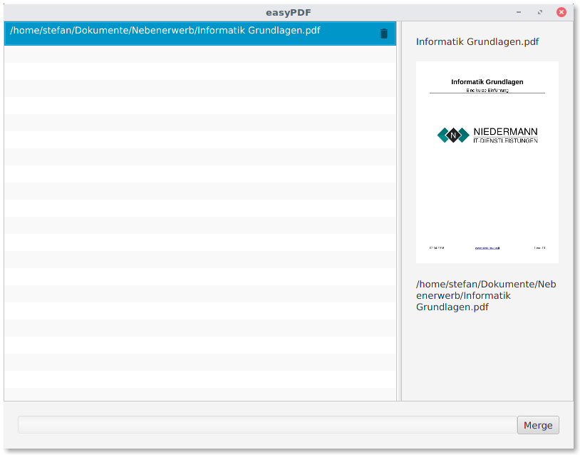

# easyPDF
📔 A simple tool based on itext to merge PDF files

## Screenshot

A major design goal of this application is simplicity. Everyone should be able to merge two or more PDF-files.

## Features

- Merge PDFs

## Roadmap

- Select output folder and filename (currently ~/Desktop/output.pdf)
- Select pages to merge in the sidebar (this would technically enable PDF splitting)
- Switch to iText v7

## Contribute

This application is build with OpenJDK 8 and OpenJFX.
If you are a developer, you can provide Pull Requests.
